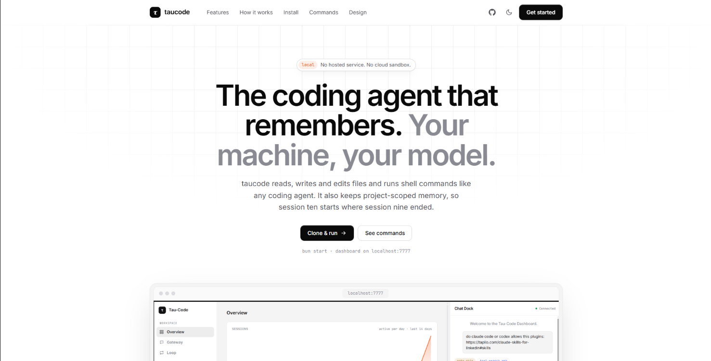
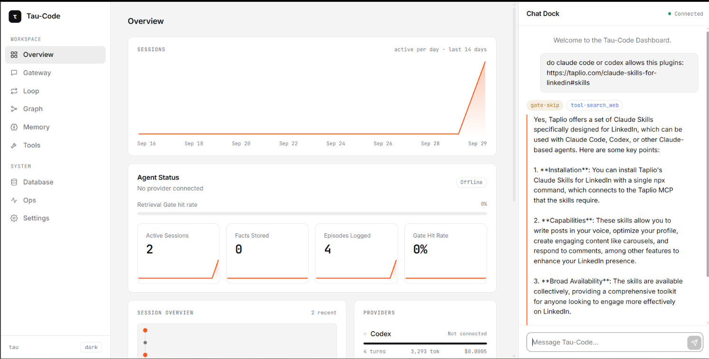
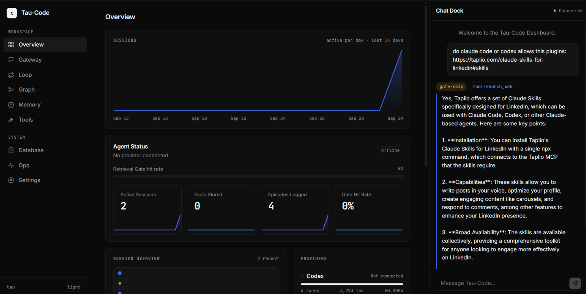

<p align="center">
  
  
  
</p>

<h1 align="center">τ taucode</h1>
<p align="center"><strong>A coding agent that remembers.</strong></p>
<p align="center">
  <a href="https://tau-code.vercel.app/">Website</a> · <a href="#quickstart">Quickstart</a> · <a href="#dashboard">Dashboard</a> · <a href="#commands">Commands</a> · <a href="#architecture">Architecture</a> · <a href="./docs/adr/">ADRs</a>
</p>

---

taucode reads, writes and edits files and runs shell commands like any coding agent — but it keeps **persistent, project-scoped memory** (facts, episode summaries, learned skills) across sessions. Session ten starts where session nine ended.

Inspired by [pi-code](https://github.com/badlogic/pi-mono) (the coding-agent tool layer) and [waku-agent](https://github.com/ShenSeanChen/waku-agent) (the memory/eval/harness pillars).

<p align="center">
  
</p>

## Highlights

| | |
|---|---|
| 🧠 **Memory that lasts** | Three kinds of memory — Facts, Episodes and Skills — stored per project in SQLite with FTS5. A Retrieval Gate decides *per turn* whether to query memory at all, so irrelevant facts never pollute context. |
| 🔀 **Provider-agnostic** | Log in to OpenAI via browser OAuth (ChatGPT/Codex subscription) or paste an Anthropic API key. Swap models mid-session with `/model`. |
| 🖥️ **Fully local** | No hosted service, no cloud sandbox. The agent, memory and live dashboard all run on your machine. Every write, edit and shell command goes through a permission gate. |
| 📊 **Live dashboard** | A minimal local web UI at `localhost:7777` with light and dark themes shows sessions, memory, tool calls, the graph workflow, traces and cost tracking in real time. |
| 🧪 **Eval suite** | Deterministic assertions + LLM-as-judge scoring, with a CI gate that fails the build when scores drop below a threshold. |
| 📝 **Tracing & cost tracking** | Every turn writes JSONL traces (`.tau/traces/`) and an append-only cost ledger (`.tau/usage.jsonl`) so you can see exactly what the agent did and what it cost. |

## Quickstart

### Prerequisites

- [Bun](https://bun.sh) (≥ 1.1)
- Git
- An OpenAI account (ChatGPT/Codex subscription) **or** an Anthropic API key

### 1. Install Bun

Skip if `bun --version` already works.

```bash
# macOS / Linux
curl -fsSL https://bun.sh/install | bash

# Windows
powershell -c "irm bun.sh/install.ps1 | iex"
```

### 2. Clone and install

```bash
git clone https://github.com/Saikat-D023/tau-code.git
cd tau-code
bun install
```

### 3. Connect a provider

```bash
bun run auth
```

**OpenAI** opens a browser OAuth login against your ChatGPT/Codex account — no API key needed. **Claude** asks you to paste an API key from [console.anthropic.com](https://console.anthropic.com).

Alternatively, copy `.env.example` → `.env` and set `OPENAI_API_KEY` or `ANTHROPIC_API_KEY`. The `.env` file is gitignored. OAuth credentials are stored at `~/.taucode/auth.json`, outside the repo.

### 4. Start tau

```bash
bun start
```

This launches:
- A **CLI chat loop** in the terminal
- A **live dashboard** at [localhost:7777](http://localhost:7777) showing reasoning, memory, tool calls and the graph workflow

On first run, tau prompts the provider picker automatically if you haven't logged in yet.

## Dashboard

`bun start` serves a local dashboard at [localhost:7777](http://localhost:7777). It is plain HTML, CSS and JS (no build step) in [`static/`](./static/), with a Hono server behind it in `src/gateway/dashboard/`. It follows your OS theme, and the toggle in the sidebar footer overrides it and remembers your choice.

| Light | Dark |
|---|---|
|  |  |

The chat dock on the right talks to the same agent as the terminal, streams reasoning and tool calls as they happen, and asks for approval before gated actions.

| Tab | What it shows |
|-----|---------------|
| **Overview** | Sessions-per-day chart, agent status, Retrieval Gate hit rate, stat cards for sessions, facts and episodes, the session branch timeline, recent Permission Gate operations, per-provider usage and recent episodes |
| **Gateway** | Unified inbox across cli, web, telegram and voice (placeholder data for now) |
| **Loop** | Every traced turn: gate decision, act/observe steps, tokens, cost and reply |
| **Graph** | Triage graph topology (placeholder until graph workflows are fully wired up) |
| **Memory** | Semantic facts, episodic summaries and procedural skills, with a Semantic / Episodic / Procedural switch |
| **Tools** | The registered tool list and connected MCP servers |
| **Database** | Table list and a read-only SQL console over `state.db` (writes are rejected) |
| **Ops** | Release gate verdict, eval history and slowest turns |
| **Settings** | Model configuration and feature flags (not yet wired to the backend) |

The dashboard uses Inter for text and JetBrains Mono for data such as numbers, IDs, timestamps and code.

## Website

The landing page is a single static file at [`site/index.html`](./site/index.html), with its images in `site/assets/` and a τ favicon. It has the same light and dark themes, with a toggle in the top bar. To preview it, open the file in a browser:

```bash
# Windows
start site\index.html

# macOS
open site/index.html

# Linux
xdg-open site/index.html
```

The dashboard also ships a τ favicon, at `static/favicon.svg`.

## Commands

### CLI commands

| Command | Description |
|---------|-------------|
| `/model` | Interactive picker for models on your current provider |
| `/model <name>` | Set model directly (e.g. `/model gpt-4o`) |
| `/auth` | Log in to or switch provider without leaving the session |
| `exit` / `quit` | End the session (Ctrl+D also works) |

### npm scripts

| Script | Description |
|--------|-------------|
| `bun start` | Start the CLI + dashboard on :7777 |
| `bun run auth` | Run the provider login flow |
| `bun run eval` | Run deterministic eval suite |
| `bun run eval:judge` | LLM-as-judge scoring |
| `bun run eval:gate` | CI gate — fails when scores drop below `TAU_EVAL_THRESHOLD` |
| `bun run trace` | Points you at JSONL traces in `.tau/traces/` |

### Agent tools

Tools the agent can invoke during a conversation:

| Tool | Permission | Description |
|------|-----------|-------------|
| `read_file` | ✅ Auto | Reads files in your project |
| `write_file` | ⚠️ Asks first | Creates or overwrites a file |
| `edit_file` | ⚠️ Asks first | Targeted in-place edits |
| `bash` | ⚠️ Asks first | Runs a shell command on your machine |
| `search_web` | ✅ Auto | Looks things up on the web |
| `manage_memory` | ⚠️ Asks first | Adds, updates or removes project facts |
| `create_skill` | ⚠️ Asks first | Saves a reusable procedure with trigger keywords |
| `update_soul` | ⚠️ Asks first | Edits `.tau/SOUL.md`, the project persona |

### Environment variables

| Variable | Description |
|----------|-------------|
| `OPENAI_API_KEY` | Optional OpenAI key (instead of OAuth login) |
| `ANTHROPIC_API_KEY` | Anthropic key for the Claude provider |
| `TAU_GRAPH_WORKFLOWS=1` | Enable the Triage Graph — routes greetings to a quick reply, everything else to the full agent loop |
| `TAU_DIR` | Override where project state (`.tau/`) lives |
| `TAU_GATE_MODEL` | Model for the retrieval gate (default: `gpt-4o-mini`) |
| `TAU_JUDGE_MODEL` | Model for the LLM-as-judge eval |
| `TAU_EVAL_THRESHOLD` | Minimum pass score for `eval:gate` |

## Memory system

taucode's memory is project-scoped, stored in `.tau/session.sqlite` using SQLite with FTS5 full-text search.

### Three kinds of memory

```
┌─────────────────────────────────────────────────────────┐
│                     Per project (.tau/)                  │
├──────────────┬──────────────────┬───────────────────────┤
│    Facts     │    Episodes      │       Skills          │
│  semantic    │  turn summaries  │  procedural memory    │
│  FTS5 search │  auto-generated  │  trigger keywords     │
│              │  consolidated    │  injected on match    │
└──────────────┴──────────────────┴───────────────────────┘
```

- **Facts** — Semantic memory. Stored per project, queried via FTS5 when the Retrieval Gate decides the current turn needs it. Irrelevant facts never enter the context.
- **Episodes** — After every turn, tau writes a one-sentence summary. These consolidate over time, so the agent remembers what you did last week without keeping the full transcript.
- **Skills** — Procedural memory. Named instructions with trigger keywords, matched against your prompt and injected into context when relevant. The agent can write new skills itself via `create_skill`.

### Retrieval Gate

Not every turn needs memory. The Retrieval Gate (a cheap, fast model call) decides per-turn whether to query facts at all, and with what search query. Greetings, math and pleasantries are short-circuited by regex before the gate model even runs.

### Soul

`.tau/SOUL.md` is the project's standing persona and preferences, injected into every turn's system context. Edit it with the `update_soul` tool or directly.

## Architecture

```
src/
├── cli/                    # CLI entry point and auth flow
├── core/
│   ├── loop.ts             # Main agent loop (turn → LLM → tools → repeat)
│   ├── model-client.ts     # ModelClient interface
│   ├── tool-dispatcher.ts  # Routes tool calls to implementations
│   ├── permission-gate.ts  # Confirms before writes/edits/shell
│   ├── operations.ts       # readFile / writeFile / editFile / executeBash
│   ├── tau-dir.ts          # .tau/ directory paths
│   ├── auth/               # Credential storage (~/.taucode/auth.json)
│   ├── graph/              # Graph workflow engine + triage graph
│   ├── memory/             # Facts, episodes, skills, retrieval gate, consolidation
│   ├── ops/                # Tracing (JSONL), usage ledger, rate tables
│   ├── providers/          # OpenAI (OAuth + API key), Claude (API key)
│   ├── session/            # SQLite session store with branching turns
│   └── tools/              # Tool implementations (read, write, edit, bash, etc.)
├── evals/                  # Deterministic + LLM-judge eval framework
└── gateway/
    ├── cli/                # Terminal chat loop
    ├── dashboard/          # Hono server for the local web dashboard
    └── telegram/           # Telegram gateway (skeleton)

static/                     # Dashboard UI (plain JS: app.js, api.js, tabs/, components/)
site/                       # Landing page (index.html, assets/, favicon.svg)
docs/                       # ADRs and README images
```

### Key design decisions

Each of these has a full ADR in [`docs/adr/`](./docs/adr/):

| ADR | Decision |
|-----|----------|
| [0001](./docs/adr/0001-local-only-execution.md) | **Local-only execution, no sandbox.** Tools run directly on your machine. The permission gate is the safety net, not a sandbox. |
| [0002](./docs/adr/0002-oauth-first-provider-auth.md) | **OAuth-first auth for OpenAI.** Browser login against your ChatGPT/Codex subscription, no API key required. |
| [0003](./docs/adr/0003-claude-api-key-not-oauth.md) | **Claude uses a real API key, not subscription OAuth.** Spoofing Claude Code's identity to use a Pro/Max subscription gets accounts banned. |

### Project state

All project-specific state lives in `.tau/` (gitignored):

```
.tau/
├── session.sqlite      # Conversation history with branching turns
├── SOUL.md             # Project persona and preferences
├── traces/             # Per-day JSONL trace files
└── usage.jsonl         # Append-only cost ledger
```

User credentials live at `~/.taucode/auth.json` (global, outside the repo).

## Evals

taucode ships two eval layers:

- **Deterministic** (`bun run eval`) — Bun test assertions against known inputs/outputs.
- **LLM-as-judge** (`bun run eval:judge`) — A judge model scores agent responses on a rubric.
- **CI gate** (`bun run eval:gate`) — Wraps both and fails the build when scores drop below `TAU_EVAL_THRESHOLD`.

## Contributing

See [CONTEXT.md](./CONTEXT.md) for the project's glossary and domain language. The ADRs in [`docs/adr/`](./docs/adr/) explain the reasoning behind bigger architectural calls — read them before proposing changes to auth, execution or memory.

## License

MIT
